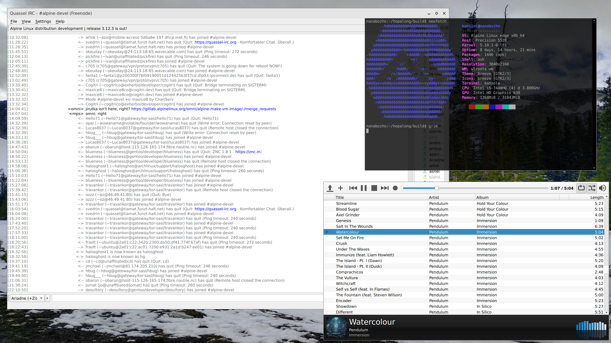

# Hopalong

Hopalong is a simple Wayland compositor with a featureset comparable to XFWM.

## Design Goals

* Window managers should stay out of the user's way and be as boring as possible.
  * No wobbly windows or other complexity.
  * Simple chrome with color themes: Choose a primary color and we do the rest.
  * Designed for people who like GNU nano as a primary editor.

* Minimal resource utilization.

* Correct functionality regardless of system byte ordering (endianness).

* Built on wlroots: a rock-solid Wayland compositor framework powering other
  compositors such as Sway.

## Screenshots

## Keybindings

Default keybindings are like X:

 * Ctrl+Alt+Backspace: Kill the compositor
 * Ctrl+Alt+F1-F12: Switch to the appropriate VT
 * Alt+Tab/Alt+Shift+Tab: Switch activities
 * Alt+F4: Send close signal to focused window
 * Alt+Shift+D: Toggle decorations for the focused window

## Install

TODO: Document how to install this crime against humanity.

## TODO

* Damage (partial rendering of the desktop)
